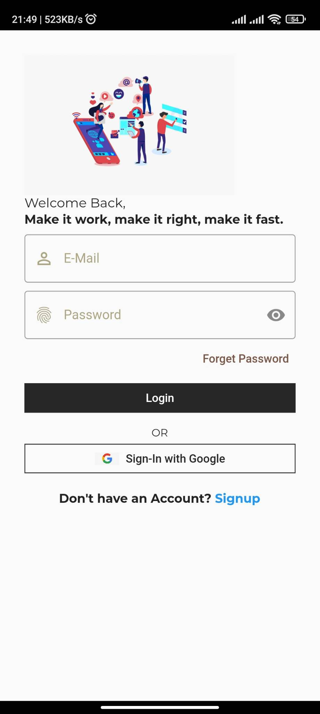
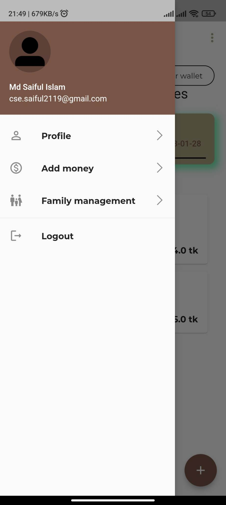
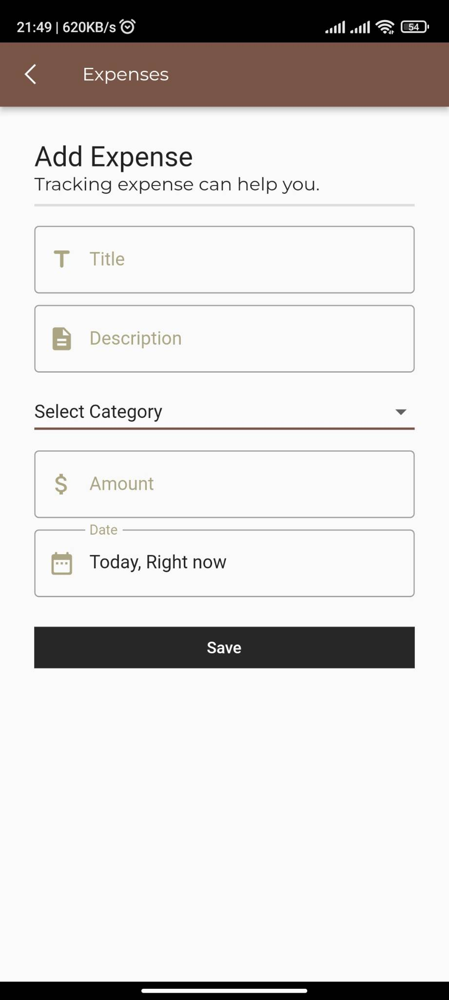
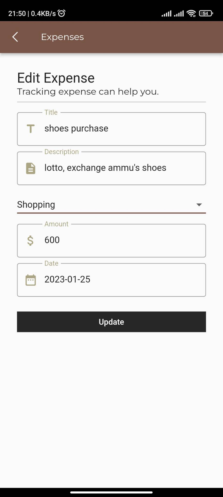

# kye Know Your Expense

A Flutter project with firebase and GETx state manager.

## Getting started

#### Welcome page

#### Login Form page

#### Sign Up Form page

#### Dashboard

#### Navigation Drawer page

#### Add Expense

#### Edit Expense

